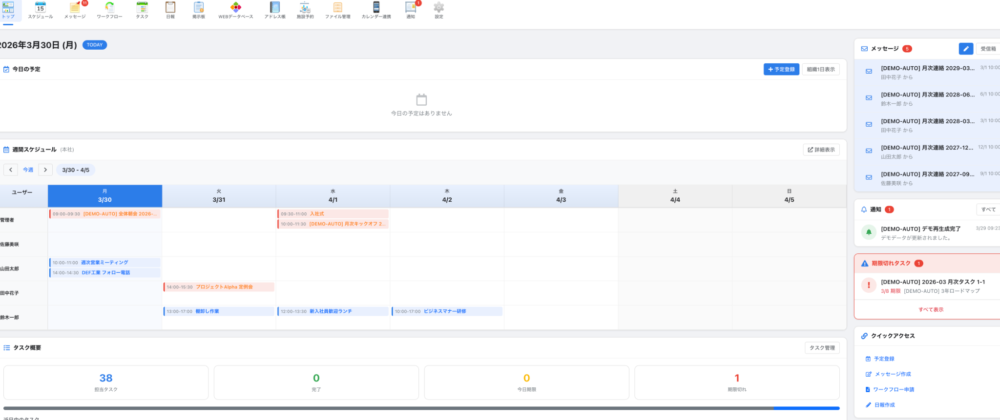
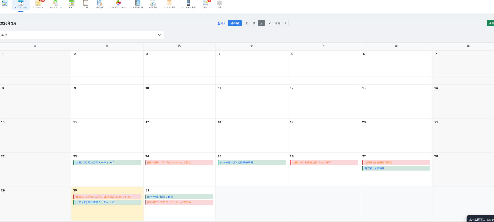
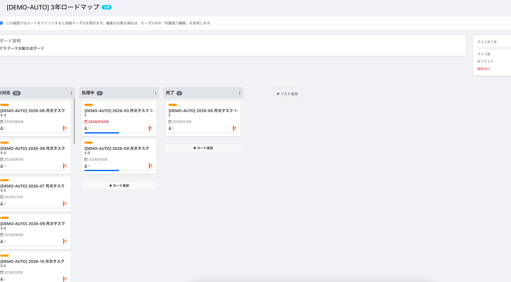
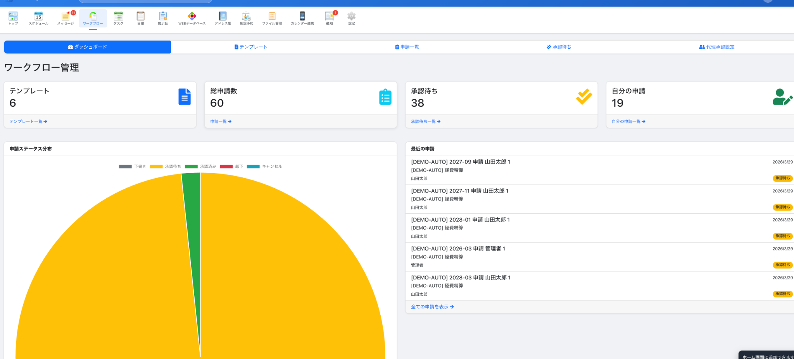
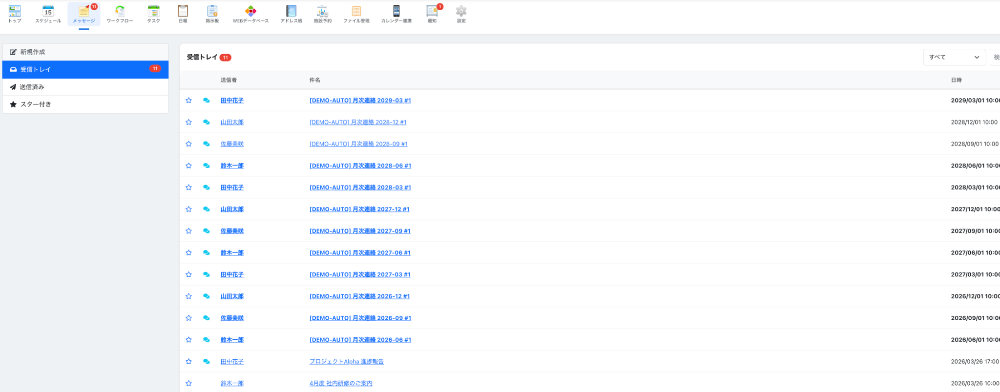
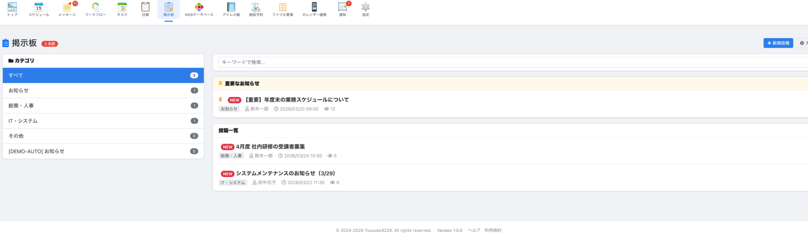

<p align="center">
  <h1 align="center">TeamSpace</h1>
  <p align="center">
    <strong>オープンソースのPHP製グループウェア</strong><br>
    A modern, open-source groupware system built with PHP
  </p>
</p>

<p align="center">
  <a href="LICENSE"></a>
  
  
  
</p>

---

## Overview / 概要

**TeamSpace** は、組織内の業務効率化を目的としたオールインワンのグループウェアシステムです。スケジュール管理、メッセージ、ワークフロー（稟議・申請）、タスク管理、掲示板、日報、ファイル管理、WEBデータベースなど、日常業務に必要な機能を網羅しています。

外部サービスへの依存がなく、自社サーバーやVPS上にセルフホストできるため、データの完全な管理が可能です。

### 主要ドキュメント
- 利用者向けヘルプ: `/help`
- 管理者マニュアル: `/help/admin-manual`
- インストールマニュアル: `/help/install-manual`

### エンタープライズ認証（新規）
- OIDC / SAML 2.0 ログイン: `設定 > 認証・PWA・SCIM`
- SCIM 2.0 ベースURL: `https://<host>/api/scim/v2`
- SAML SP Metadata: `https://<host>/auth/saml/metadata`
- SSO誤設定時の非常口ログイン: `https://<host>/login/local-admin`

---

## Screenshots / スクリーンショット

> 準備中 - スクリーンショットは近日追加予定です

| ダッシュボード | スケジュール（月表示） | タスクボード |
|---|---|---|
|  |  |  |

| ワークフロー | メッセージ | 掲示板 |
|---|---|---|
|  |  |  |

---

## Features / 機能一覧

### 📅 スケジュール管理
- 日・週・月ビューでの個人スケジュール管理
- 組織単位でのスケジュール共有（組織 日・週・月ビュー）
- 参加者の管理と参加ステータス追跡
- Google Calendar / iCal 連携（ICSインポート・エクスポート）
- 外部カレンダー購読（iCal URL同期）

### 💬 メッセージ
- 受信トレイ・送信済み・スター付きの管理
- 返信・全員に返信・転送
- 未読管理とスター機能

### 📋 掲示板
- カテゴリ別の投稿管理
- コメント機能
- 組織内の情報共有に最適

### 📝 ワークフロー（稟議・申請）
- カスタマイズ可能な申請テンプレート
- ドラッグ&ドロップのフォームデザイナー
- 多段階承認経路の設定
- 代理承認機能
- 申請の統計情報ダッシュボード
- PDF / CSVエクスポート

### ✅ タスク管理（カンバンボード）
- 個人・チーム・組織単位のタスクボード
- ドラッグ&ドロップでのカード移動
- チェックリスト、ラベル、コメント機能
- チームの作成と管理

### 📊 日報
- テンプレート + 構造化項目による日報作成
- リッチテキスト本文入力
- 活動ログ（時系列）入力
- 分析明細（案件 / 業種 / 商品 / プロセス）入力
- 月目標管理（予実比較）
- 添付ファイル、コメント、いいね
- 週間 / 月間 / タイムライン / 分析ビュー
- 分析結果のCSV出力

### 📁 ファイル管理
- フォルダ階層によるファイル管理
- バージョン管理（チェックアウト / チェックイン）
- ファイル単位のアクセス権限設定
- 承認リクエスト機能

### 🗄️ WEBデータベース
- 独自フィールド定義によるカスタムデータ管理
- GUIフォームビルダー（並び替え / セクション / 表示切替 / 必須設定）
- リレーション・ルックアップ機能
- 親子テーブル入力（ヘッダ + 明細）
- 保存ビュー（ユーザー / 組織 / 全体）
- 集計ビュー・グラフビュー（件数 / 合計 / 平均）
- CSV インポート・エクスポート
- レコード間の関連付け
- 管理者向けデモサンプル投入（売上・売上明細を含む）

### 📇 アドレス帳
- 連絡先情報の一元管理
- CSVインポートによる一括登録

### 🏢 施設予約
- 会議室・備品などの施設管理
- 予約の作成・管理

### 🔔 通知システム
- リアルタイム通知
- メール通知（SMTP / sendmail / PHP mail()）
- 通知設定のカスタマイズ
- メール送信キュー処理
- PWA Push 通知（購読 / 解除 / テスト送信）

### 📱 PWA（Progressive Web App）
- ホーム画面追加・インストール対応（iOS/Android/PC）
- `manifest.json` / `service-worker.js` によるアプリ体験
- オフライン時のフォールバック画面
- ブラウザ通知基盤（Web Push）連携

### 🔍 全文検索
- 横断的な全文検索機能

### 🔗 外部連携
- Google Calendar 連携
- iCal 形式でのカレンダー公開
- 外部カレンダー購読・同期
- CSV エクスポート
- SSO 連携（OIDC / SAML 2.0）
- SCIM 2.0 によるユーザープロビジョニング

### ⚙️ 管理機能
- ユーザー管理（作成・編集・パスワード変更）
- 組織管理（階層構造対応）
- CSV一括インポート（ユーザー・組織・アドレス帳）
- システム設定（メール設定・通知設定）
- 認証・PWA・SCIM 設定
- 非常用ローカル管理者ログイン導線（SSO誤設定時の復旧）
- デモデータ管理（本日から3年分の補充 / 全再構築）

### 📱 レスポンシブ対応
- モバイルフレンドリーなUI

---

## Requirements / 動作環境

| 項目 | 要件 |
|------|------|
| PHP | 8.1 以上 |
| MySQL | 5.7 以上 |
| Webサーバー | Apache（mod_rewrite 有効）または Nginx |
| Composer | 2.x |

---

## Quick Start / クイックスタート

```bash
# リポジトリをクローン
git clone https://github.com/Yuusuke9228/groupware.git
cd groupware

# 依存パッケージをインストール
composer install

# 設定ファイルをコピー
cp config/database_sample.php config/database.php
cp config/config_sample.php config/config.php

# データベース設定を編集
vi config/database.php

# データベースを作成・セットアップ
mysql -u root -p -e "CREATE DATABASE groupware CHARACTER SET utf8mb4 COLLATE utf8mb4_general_ci;"
mysql -u root -p groupware < db/schema.sql

# Webサーバーの DocumentRoot を public/ に設定
# ブラウザでアクセス → admin / admin123 でログイン
```

---

## Installation / インストール手順

### 方法1: 手動インストール

#### 1. リポジトリのクローン

```bash
git clone https://github.com/Yuusuke9228/groupware.git
cd groupware
```

#### 2. 依存パッケージのインストール

```bash
composer install
```

#### 3. 設定ファイルの準備

```bash
cp config/database_sample.php config/database.php
cp config/config_sample.php config/config.php
```

#### 4. データベース設定

`config/database.php` を編集し、お使いの環境に合わせて設定してください:

```php
return [
    'host'     => 'localhost',
    'dbname'   => 'groupware',
    'username' => 'your_db_user',
    'password' => 'your_db_password',
    'charset'  => 'utf8mb4_general_ci',
    'port'     => 3306
];
```

#### 5. アプリケーション設定

`config/config.php` を編集し、必要に応じて設定を変更してください:

```php
return [
    'app' => [
        'name'     => 'GroupWare',
        'version'  => '1.2.0',
        'timezone' => 'Asia/Tokyo',
        'debug'    => false,        // 本番環境では false に設定
        'url'      => 'https://your-domain.com'
    ],
    'auth' => [
        'session_name'     => 'gsession_user',
        'session_lifetime' => 86400,
        'remember_me_days' => 30
    ],
    'upload' => [
        'max_size'           => 10485760, // 10MB
        'allowed_extensions' => ['jpg','jpeg','png','gif','pdf','doc','docx','xls','xlsx','ppt','pptx']
    ]
];
```

#### 6. データベースのセットアップ

```bash
mysql -u root -p -e "CREATE DATABASE groupware CHARACTER SET utf8mb4 COLLATE utf8mb4_general_ci;"
mysql -u root -p groupware < db/schema.sql
```

#### 7. Webサーバーの設定

**Apache の場合:**

```apache
<VirtualHost *:80>
    ServerName groupware.example.com
    DocumentRoot /path/to/groupware/public

    <Directory /path/to/groupware/public>
        AllowOverride All
        Require all granted
    </Directory>
</VirtualHost>
```

`mod_rewrite` が有効であることを確認してください:

```bash
sudo a2enmod rewrite
sudo systemctl restart apache2
```

**Nginx の場合:**

```nginx
server {
    listen 80;
    server_name groupware.example.com;
    root /path/to/groupware/public;
    index index.php;

    location / {
        try_files $uri $uri/ /index.php?$query_string;
    }

    location ~ \.php$ {
        fastcgi_pass unix:/run/php/php-fpm.sock;
        fastcgi_param SCRIPT_FILENAME $document_root$fastcgi_script_name;
        include fastcgi_params;
    }
}
```

#### 8. ディレクトリの権限設定

```bash
# 既存権限を壊さないため、必要最小限のみ設定
chmod 775 uploads exports public/uploads
```

#### 9. メール通知の設定（任意）

管理画面の「設定 > メール設定」から送信方式（SMTP / sendmail / PHP mail()）を設定できます。

メール送信キューを処理するには、cronを設定してください:

```bash
# crontab -e
* * * * * php /path/to/groupware/scripts/process_email_queue.php
# デモサイト自動復旧（毎月1日 03:30）
30 3 1 * * php /path/to/groupware/scripts/rebuild_demo_data.php --mode=rebuild --years=3
```

### デモデータの手動実行

```bash
# 本日から3年分のデモデータを補充
php scripts/rebuild_demo_data.php --mode=refresh --years=3

# 全データをデモ用に再構築（破壊的）
php scripts/rebuild_demo_data.php --mode=rebuild --years=3
```

### 方法2: Webインストーラー

> Webインストーラーが利用可能な場合、ブラウザから `/install` にアクセスして画面の指示に従ってください。

### 既存環境のアップグレード

既存環境を更新する場合は、`db/schema.sql` を丸ごと再適用せず、`db/upgrade_*.sql` を新しい日付順に適用してください。

```bash
# 例: 直近の追加アップグレードを適用
mysql -u <user> -p <database> < db/upgrade_20260327_daily_report_structured.sql
mysql -u <user> -p <database> < db/upgrade_20260328_daily_report_advanced.sql
mysql -u <user> -p <database> < db/upgrade_20260328_fk_stability.sql
mysql -u <user> -p <database> < db/upgrade_20260328_webdatabase_nocode.sql
```

適用前には必ず DB バックアップを取得してください。

---

## Default Login / 初期ログイン情報

| 項目 | 値 |
|------|------|
| ユーザー名 | `admin` |
| パスワード | `admin123` |

> **重要:** ログイン後、必ず管理者パスワードを変更してください。

---

## Configuration / 設定

### 環境変数

環境変数による設定の上書きに対応しています。`.env` ファイルまたはサーバー環境変数で設定可能です。

#### メール設定

| 環境変数 | 説明 | 例 |
|----------|------|-----|
| `GW_MAIL_TRANSPORT` | 送信方式 | `smtp`, `sendmail`, `mail` |
| `GW_MAIL_FROM_EMAIL` | 送信元メールアドレス | `noreply@example.com` |
| `GW_MAIL_FROM_NAME` | 送信者名 | `GroupWare` |
| `GW_MAIL_REPLY_TO_EMAIL` | 返信先アドレス | `support@example.com` |

#### SMTP設定

| 環境変数 | 説明 | 例 |
|----------|------|-----|
| `GW_SMTP_HOST` | SMTPサーバー | `smtp.gmail.com` |
| `GW_SMTP_PORT` | ポート番号 | `587` |
| `GW_SMTP_SECURE` | 暗号化方式 | `tls`, `ssl` |
| `GW_SMTP_AUTH` | SMTP認証 | `true` |
| `GW_SMTP_USERNAME` | SMTPユーザー名 | `user@gmail.com` |
| `GW_SMTP_PASSWORD` | SMTPパスワード | `app-password` |
| `GW_SMTP_TIMEOUT` | タイムアウト(秒) | `30` |
| `GW_SMTP_ALLOW_SELF_SIGNED` | 自己署名証明書許可 | `false` |

#### その他

| 環境変数 | 説明 | 例 |
|----------|------|-----|
| `GW_SENDMAIL_PATH` | sendmailパス | `/usr/sbin/sendmail` |
| `GW_APP_URL` | アプリケーションURL | `https://groupware.example.com` |

---

## Project Structure / ディレクトリ構造

```
groupware/
├── config/             # 設定ファイル
├── Controllers/        # コントローラー
├── Core/               # コアライブラリ (Router, Auth 等)
├── db/                 # データベーススキーマ
├── exports/            # エクスポートファイル出力先
├── Models/             # モデル
├── public/             # 公開ディレクトリ (DocumentRoot)
│   ├── index.php       # エントリーポイント
│   ├── css/            # スタイルシート
│   ├── js/             # JavaScript
│   └── uploads/        # アップロードファイル
├── scripts/            # バッチスクリプト
├── uploads/            # ファイル管理用アップロードディレクトリ
└── views/              # ビューテンプレート
```

---

## Testing / テスト

```bash
composer test
# または
vendor/bin/phpunit
```

主なユニットテスト:
- `tests/Unit/WebDatabaseValidationServiceTest.php`
- `tests/Unit/FilePermissionServiceTest.php`
- `tests/Unit/ScheduleDisplaySettingsTest.php`

---

## Contributing / コントリビュート

コントリビュートを歓迎します。詳細は [CONTRIBUTING.md](CONTRIBUTING.md) をご覧ください。

基本的な流れ:

1. このリポジトリをForkする
2. フィーチャーブランチを作成する (`git checkout -b feature/amazing-feature`)
3. 変更をコミットする (`git commit -m 'Add amazing feature'`)
4. ブランチをPushする (`git push origin feature/amazing-feature`)
5. Pull Requestを作成する

---

## License / ライセンス

このプロジェクトは [GNU General Public License v3.0](LICENSE) のもとで公開されています。

---

## Author / 作者

- **Yuusuke9228** - [GitHub](https://github.com/Yuusuke9228)

---

## Acknowledgements / 謝辞

このプロジェクトは以下のオープンソースライブラリを使用しています:

- [TCPDF](https://github.com/tecnickcom/TCPDF) - PDF生成
- [PHPMailer](https://github.com/PHPMailer/PHPMailer) - メール送信
